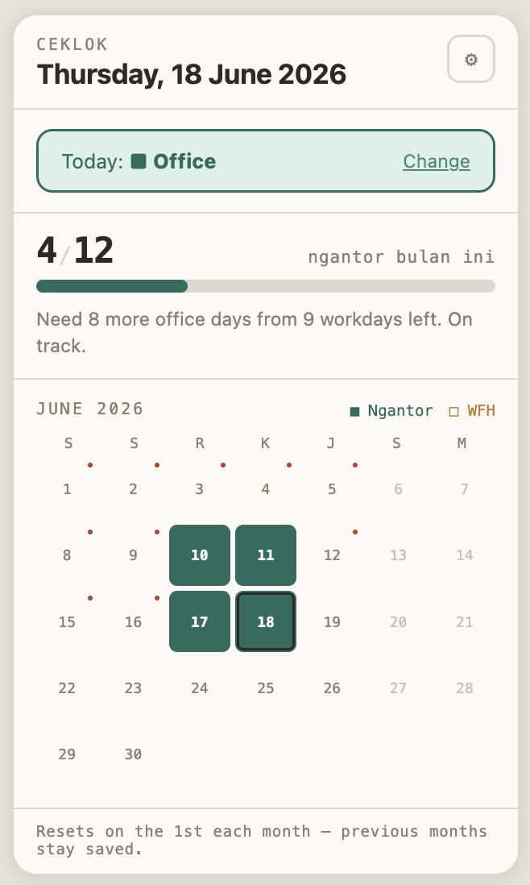
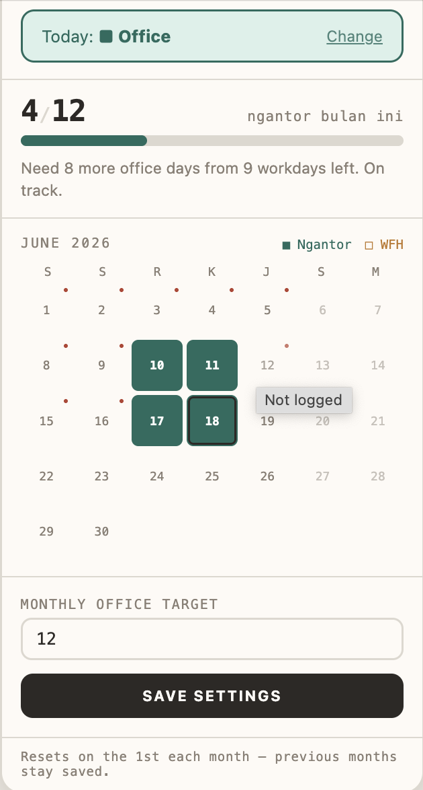

# ceklok


Chrome extension for logging office vs WFH days and tracking your monthly office attendance target (default: 12 days/month). Auto-resets each month — previous month data stays in storage, progress bar and insight start fresh.

## Preview

| Main popup | Settings |
|---|---|
|  |  |
| Log today's status, track progress, and see the full month at a glance. | Adjust your monthly office target. |

## Installation (load unpacked — not published to Chrome Web Store)

1. Open `chrome://extensions` in Chrome.
2. Enable **Developer mode** (toggle top-right).
3. Click **Load unpacked**.
4. Select this folder (the one containing `manifest.json`).
5. Pin the icon to your toolbar (click the puzzle icon 🧩 → pin "Ceklok").

## Usage

- **Click the extension icon** → popup opens. If today isn't logged yet, click **■ Office** or **□ WFH**.
- Already logged? Popup shows today's status + a **Change** button to correct it.
- **Progress bar** shows `X/target` office days this month, plus a short insight (e.g. "Need 8 more office days from 9 workdays left").
- **Punch-card grid** shows the full month: solid green = office, orange = WFH, grey = weekend, small red dot = past weekday not yet logged. Click any past weekday cell to log or edit it.
- Badge on the toolbar icon = office day count this month (orange if below target, green if at/above).
- To change the monthly target: click ⚙ (top-right) → adjust → **Save settings**.

## Monthly reset

Data is stored per-month (key `YYYY-MM` in `chrome.storage.local`). Once the 1st passes, progress resets to 0/target automatically — no manual action needed. Previous months remain in storage (no history UI yet, but the data is there).

## File structure

```
manifest.json     → extension config (Manifest V3)
background.js     → service worker: badge updates
popup.html/css/js → popup UI and logic
shared.js         → date helpers and storage utilities, shared by popup and background
icons/            → 16/32/48/128px icons
preview/          → screenshots
```

## Notes

- All data is stored locally in your browser (`chrome.storage.local`) — no external server.
- To sync across devices, replace `chrome.storage.local` with `chrome.storage.sync` in `shared.js` and `background.js` (requires same Chrome login on all devices).
